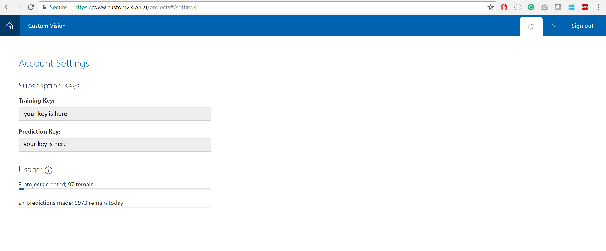
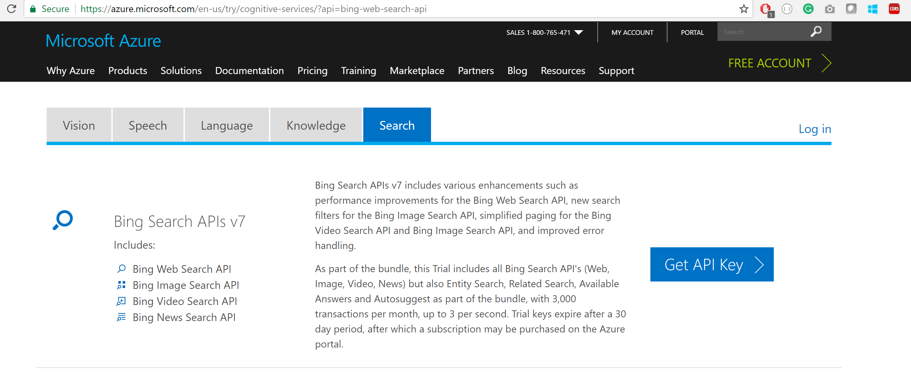
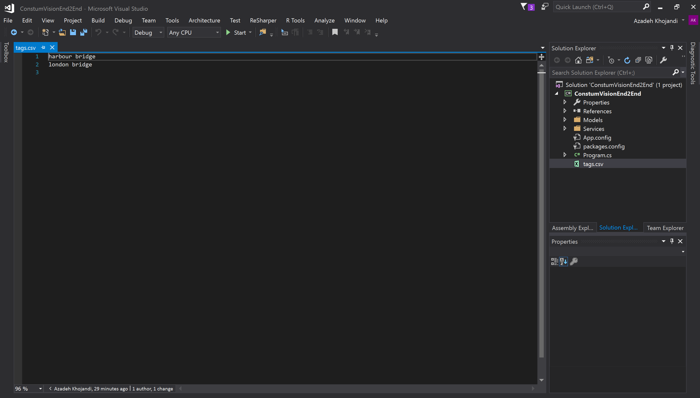
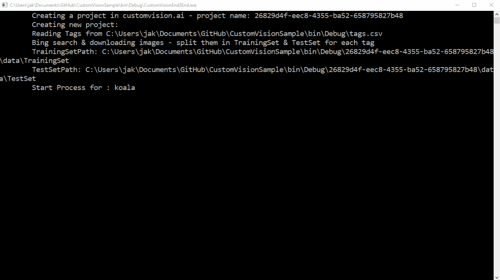

# Custom Vision Generator
A tool for generating a custom vision projects. It will automatically find and download images of topics you input, train the model and export a confusion matrix in CSV format.

## Pre-requisites
You'll need to install [Visual Studio](https://www.visualstudio.com/vs/community/) to build and run this code. 

## Steps to run the sample
1. Sign in or create a new account on [customvision.ai](https://www.visualstudio.com/vs/community/)
2. After login - click on cog icon on the right hand side and copy key values into the appropriate app settings

    
3. Register for the free [Bing Search service](https://azure.microsoft.com/try/cognitive-services/?api=bing-web-search-api) then copy the key value into the app settings

### Optional Steps 

4. Set the value of 'Randomize' in app settings to `True` if you want to randomize the result of search for training and testing the model. 

5. To enable smart resizing, set the value of `SmartResize` to `True` then [Get a Computer Vision API key](https://docs.microsoft.com/en-us/azure/cognitive-services/Computer-vision/Vision-API-How-to-Topics/HowToSubscribe) to perform the smart thumbnails of downloaded images.
You also can set `AugmentTrainingImages` to `True` to increase the size of the training dataset

## Running the application

The app will create a project in your custom vision dashboard with a random GUID. Please note that each time you run the app, a new project will be created. Next the app reads all the tags in the `tags.csv` file. The system searches Bing Images for each tag to prepare the source set of images for the classifier. 

By default it downloads eight images for each tag. Five images for training and Three images for testing. Depends on what you are classifying, you can increase the number of `TrainingImagesCount` and `TestImagesCount` to get better accuracy, precision and recall.

After downloading the images, the app will then upload the photos into the customvision.ai project and tag them accordingly.

Now the model has enough data to be trained. The app will train the model and set the default iteration to the newly trained model.

The model is ready for testing so the app will try to test the model the results of which are exported as a confusion matrix into `result.csv`.
You can check the quality of your model by reviewing the [confusion matrix](https://en.wikipedia.org/wiki/Confusion_matrix).

As you are running the app you should see output similar to this animation. 

##  More information on the Azure Custom Vision Service

- [Start here](https://docs.microsoft.com/en-au/azure/cognitive-services/custom-vision-service/home)
- [Custom Vision API C# Tutorial](https://docs.microsoft.com/en-au/azure/cognitive-services/custom-vision-service/csharp-tutorial)
